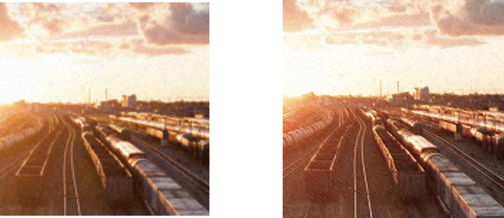

# DRDM-Net


## Important Issue!!

*This repository is also for multi-task training for AIM2020 (Advances in Image Manipulation) and the modified framework and yaml file is uploaded here:*

*If you train as follows, the result won't be so good but it may help to learn about what this track (real-SR) if you would like to join us in this competition team.*

For understanding the pipeline, please follow the codes for re-implementing the codes.

```shell
cd ESRGAN-FT with DRDM and MixCorrupt
python3 train.py -opt train_realSR_x3_RRDB.yml
```

or 

```shell
python3 train.py -opt train_realSR_x4_RRDB.yml
```

for 4x tasks.

*Remember to prepare the dataset on your own.*


From baseline model: [ICCVW 2019] PyTorch implementation of DSGAN and ESRGAN-FS from the paper "Frequency Separation for Real-World Super-Resolution". This code was the winning solution of the AIM challenge on Real-World Super-Resolution at ICCV 2019

Made some modifications on it for research and course (the CoSRGAN method and MSRResNet are modifications on research(unfinished) and can be ignored if you are the TA of Computational Photography)

Here are the ways to reimplement my result.


## Part I: DSGAN

I made some changes on it. Please prepare your datasets and configure the *Cycled DSGAN/paths.yml* respectively.

Then run the following shell commands:

```python
python3 train_basic.py
```
 for baseline network,

 and run the commands:

 ```python
python3 train_semi_cycle.py
 ```
 for my modification (Cycled DSGAN).

 ## Part II: ESRGAN with DRDM and MixCorrupt

 Please run 

 ```python
python3 train.py -opt options/[Your Artifacts]/train_[your track(SDSR/TDSR)].yml
 ```

Configure the yaml file by the folder the pretrained model and DSGAN model respectively.

**If you wanna try DRDM or MixCorrupt, just change the configurations in those yaml files.**

*The DPED method yaml file is for my future experiments, so if there are any need for expreimenting on that, please change it as the yaml files in Gaussian or JPEG.*

For testing, use

```
python3 test.py
```
command.

If there are any problem, welcome to contact be at realtimothyhwu@gmail.com and we can talk about ideas and experiments.


The following are the picture results of the proposed method and my modification.


## Qualitative Results on Baseline

### DSGAN Result

The following image may show that the DSGAN can finish the task well.


The left, middle, right are reference 'Real-World' image, generated image of DSGAN and input. The generated high frequency texture distribution has reached very similar with the reference image.

### Final SR Result

In this subsection, we compare the final SR result with the ESRGAN, seeing that it eliminates nearly all the noises from the input while the ESRGAN is troubled much with noise artifact. 


## Modified Pipeline


The modified pipeline has similar qualitative results on the task above, and the result of modified pipeline will only be shown in **Generalization task** in the following part.

## Generalization Result

This is the generalization result from DPED TDSR to Gaussian.




We can see the Guassian noises are nearly eliminated.

## Real Real-world Result

The input real real-world image is shot by myself (Oneplus 7 Pro rear camera set; High ISO; Crop) at dawn and night and make real jpeg corruption in : it is deliberately designed so that it is very much ''Real" and no networks has seen such image before. We shall see the generalization ability of the Baseline and **Ours**.

The sample input is crop from the center of the following image with very bad quality.


Baseline Result


Our result: **avoidance of blockwise artifact and strange over-sharpening.**


For more comparison, please refer to the folders *Baseline Results* and *Our results* to see our modification's well generalization performance.
